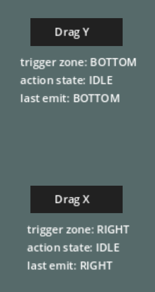

# Elastic Controls

### Objective

Create a draggable control that has triggered behaviour at a definable point within the node's range of movement.

Make the node generic enough that it can be dropped into an existing program with minor configuration.

Explore giving the node an elastic feel. As the node reaches the outer limits of its movement range slow the movement to give a feeling of resistance. On release, animate the node moving back to its original position with similar movement.

### Outcome

Created a simple, reusable `Control` scene that can be dragged by the user and can trigger behaviour if the `Control` is released past a configurable threshold. On release, the `Control` will smoothly tween back to its original position.

The `Control` includes export variables to support easy setting of x/y max offset values, trigger threshold, axis direction constraint, release tween back to default position animation length, and the default label text. Additional confirmed to work appropriately on Android.

Drag resistance was not implemented as it became obvious during development that it wasn't necessary.

It also includes on screen state information while in debug mode.



### Additional Notes

#### Click, Drag, and Release

My initial expectation was that once I had movement figured out, that constraining that movement would be easy. If I could capture the cursor location as a `Vector2` on click, I could apply the delta between the click location and the current location to the node I am trying to move.

I dropped in a new `Label` and found myself annoyed at how limited the ability to theme it is. Recognized that I was going to have to add a `ColorRect` as parent to get the aesthetic I wanted.

Updated the `Label > Mouse > Filter` property to `Pass (Propogate Up)`. Without this set the label will eat any input events it receives. With this set it will propogate the event up to the parent, which is what we're looking for in this case.

Added a script to the parent `ColorRect` and tossed this into its own scene. This way we can just create as many instances of this as needed.

Looking through the [documentation for `ColorRect`](https://docs.godotengine.org/en/stable/classes/class_colorrect.html), I wasn't seeing anything for mouse input. On the `Control` object, that it inherits from, there is a [`_gui_input()`](https://docs.godotengine.org/en/stable/classes/class_control.html#class-control-private-method-gui-input) virtual method that will handle input events.

Put in a basic version, just to see what events it fires back.

```python
func _gui_input(event) -> void:
	print(event)
```

This gives a ton of information, but the important pieces I parsed out were the following:

```
Left Click
InputEventMouseButton: button_index=1, mods=none, pressed=true, canceled=false, position=((9.0, 22.0)), button_mask=1, double_click=false

Left Release
InputEventMouseButton: button_index=1, mods=none, pressed=false, canceled=false, position=((9.0, 22.0)), button_mask=0, double_click=false

Left Drag
InputEventMouseMotion: button_mask=1 (Left Mouse Button), position=((5.0, 20.0)), relative=((-4.0, -2.0)), velocity=((3.84422, -0.768844)), pressure=1.00, tilt=((0.0, 0.0)), pen_inverted=(false)
```

As soon as I had the drag event `InputEventMouseMotion` with `button_mask=1`, it was straight forward to track the event's position.

```python
if (event is InputEventMouseMotion && event.button_mask == 1):
	print(event.position)
```

I attempted to move the node with the input event at this point. It started jumping all over the screen. My node was in the middle of a 500, 500 px window. The event position, as above, was returning very small numbers that didn't reflect this global position.

```python
position=((5.0, 20.0))
```

This was causing the node to rapidly jump in an offset between the node's appropriate position and the cursor's local position translate to global space. The cursor's local position then moves relative to the node. I was effectively measuring a moving position, instead of a fixed one.

From there I read all the values available in the `InputEventMouseMotion` event and saw this:

```python
relative=((-4.0, -2.0))
```

This is the distance relative to the last movement. By taking the current position of the node and offsetting it by the relative position of the `InputEventMouseMotion`, the `Control` smoothly follows the cursor.

```python
if (event is InputEventMouseMotion && event.button_mask == 1):
	position = position + event.relative
```

The lesson, of course being, I should probably see what all the values I have available to me are before I just start trying to implement something with the first thing that I see that might work.

Release, for the time being, was just a matter of getting it back to its original position. I just needed to capture the original position and set its position back to that value on release. The part of this that tripped me up for a moment was getting that original position.

I had initially grabbed the position from the `_init()` function. This was incorrect as it was grabbing the position of `ColorRect` within the draggable color rect scene of `(0, 0)`. It needed to be from the `_ready()` function, as that returnns the location it was placed in parent, the main scene.

As an initial workaround for the `_init()` position value, I had initialized the `node_start_position` as `Vector2.INF`. I then checked to see if `node_start_position` was in this default state as part of the `_on_gui_input()` function. If so, assign it the appropriate value. Quickly replaced that with the setting the value in the `_ready()` function, but it was an interesting enough detour to mention.

The event for releasing a click is an `InputEventMouseButton` with the `event.pressed` set to `false`.

The full code to drag and release, up to this point:

```python
extends ColorRect

var node_start_position: Vector2

func _ready() -> void:
	node_start_position = position

func _on_gui_input(event: InputEvent) -> void:
	if (event is InputEventMouseButton && event.pressed == false):
		position = node_start_position
	if (event is InputEventMouseMotion && event.button_mask == 1):
		var drag_offset: Vector2 = Vector2(event.relative.x, 0)
		position = position + drag_offset
```

Realized while writing up these notes that I'd included a bug in there. I'm not handling the button for the release. This means any input where `event.pressed` is `false` will trigger the release code. It needs to include a `event.button_index` in there.

```python
if (event is InputEventMouseButton && event.button_index == 1 && event.pressed == false):
```
#### Constraining Movement

There are two points that I wanted to hit with this.

1. The axis the node is allowed to move on.
2. The distance the node can travel in any given direction.

Axis contraints were surprisingly easy. I create an enum and an export variable to make this easily configurable per instance.

```python
enum ConstraintAxis {X, Y}

@export var constrain_axis_direction: ConstraintAxis = ConstraintAxis.X
```
Then within the `_on_gui_input()` function, I added a check against `constrain_axis_direction` and reset the x/y position to `node_start_position`.

```python
if constrain_axis_direction == ConstraintAxis.X:
	new_position.y = node_start_position.y
else:
	new_position.x = node_start_position.x
```

I then added another export variable for the maximum distance a node can travel in any given direction. I have this in as a `Vector2` as my original work had an option to leave the node with no axis constraints. It could just be an `int` or a `float`, but leaving it as a `Vector2` makes clamping the node within the max offset easier. It's just added two `Vector2` values together instead of determining which x/y value we need and performing addition on that specific value.

```python
new_position = new_position.clamp(node_start_position - max_offset, node_start_position + max_offset)
```

#### Trigger Points

My approach here was to set up an export variable with the trigger threshold. Essentially, how far the node has to travel and be released to trigger a behaviour. Calculate the position offset (`node_start_position` - the current position). If that absolute value is greater than the trigger threshold, it will trigger behaviour on release.

There was a lot of testing involved in getting this up and running. Most of it not terribly interesting. My initial thought was to create a boolean latch variable to handle this, but realized I was tracking state and it was probably just cleaner to create a simple state variable and manage that.

Created a new `enum` called `Trigger` and variable to track it called `trigger_state`.

```python
enum Trigger { NONE, LEFT, RIGHT, TOP, BOTTOM }

var trigger_state: Trigger = Trigger.NONE
```
This was the point where I pulled unconstrained directionality and forced constraining to a single axis. The behviour could be extended to four way directionality (or more), but it was way out of scope of what I was trying to achieve here. A good reminder to myself that I'm experimenting, not building production code.

Added a `trigger_threshold` as an export variable. Which then puts the `Control` in a position where the threshold could exceed the maximum offset, creating unreachable behaviour. To handle this I added some `assert()` calls in the `_ready()` function.

```python
assert(trigger_threshold > 0, "Trigger Threshold must be greater than 0.")

if (constrain_axis_direction == ConstraintAxis.X):
	assert(max_offset.x >= trigger_threshold, "Trigger Threshold > Max Offset x. Trigger is unreachable.")
else:
	assert(max_offset.y >= trigger_threshold, "Trigger Threshold > Max Offset y. Trigger is unreachable.")
```
Now that I've got my trigger states, it was a question of tracking which state we're currently in. I'm not really using the state machine pattern properly here, but it's functional for this case.

```python
match trigger_state:
	Trigger.NONE:
		if (position_offset.x > trigger_threshold):
			set_trigger(Trigger.LEFT)
		elif (position_offset.x < -trigger_threshold):
			set_trigger(Trigger.RIGHT)
		if (position_offset.y > trigger_threshold):
			set_trigger(Trigger.TOP)
		elif (position_offset.y < -trigger_threshold):
			set_trigger(Trigger.BOTTOM)
	Trigger.LEFT, Trigger.RIGHT:
		if (abs(position_offset.x) < trigger_threshold):
			set_trigger(Trigger.NONE)
	Trigger.TOP, Trigger.BOTTOM:
		if (abs(position_offset.y) < trigger_threshold):
			set_trigger(Trigger.NONE)
```
Where `set_trigger()` just changes the trigger state. It's stubbed out to provide essential behaviour with an expectation it could be extended.

```python
func set_trigger(state: Trigger) -> void:
	trigger_state = state
```

On release, check if trigger state is anything other than `Trigger.NONE`. If so, emit a signal for trigger to be handled by another script and set the `trigger_state` back to `Trigger.NONE`.

#### Elastic Movement

At this point, I had basically decided I liked the behaviour where it followed the cursor on a 1:1 basis until it hits the offset limit. I removed elastic dragging as a requirement and focused on the reset behaviour.

This was trivial using a `Tween`. The entire thing was handled by the tween itself. The full code for handling the tween is just these three lines.

```python
tween = create_tween()
tween.set_trans(Tween.TRANS_CUBIC).set_ease(Tween.EASE_OUT)
tween.tween_property(self, "position", node_start_position, release_tween_length)
```

It creates a tween, set the transition mode, sets the transition easing, and then tweens the position property of the node.

I've noted this down just for my own reference.

```
.tween_property(
	object,
	object property,
	property target value,
	tween duration in seconds
)
```

I set the `tween` variable as file scoped which can lead to an issue of repeatedly creating the tween over and over. A recommendation is the following pattern to prevent that.

```python
if tween:
	tween.kill
tween = create_tween()
```

I didn't use this pattern, as I want to be able to control more than just the tween as part of my node's action state. Leading to another enum.

```python
enum Action { IDLE, DRAG, RELEASED }
```

This way I could limit any release behaviours from occuring to only when the current action state is `DRAG`. Dragging actions could only occur when the current action state is not `RELEASED`.

Tweens run sequentially. By adding a callback on the tween after the initial `.tween_property()`I can change the state back to `IDLE` after the tween has completed.

On release the `reset_position()` function is called which does the following.

```python
func reset_position() -> void:
	tween = create_tween()
	tween.set_trans(Tween.TRANS_CUBIC).set_ease(Tween.EASE_OUT)
	tween.tween_property(self, "position", node_start_position, release_tween_length)
	tween.tween_callback(set_action.bind(Action.IDLE))
```

This prevents duplicates tweens or from the user grabbing the node during a release tween and attempting to drag it.

I put a minimal amount of work into tweaking the tween into looking the way I wanted it to. I got some help from this interactive tween cheat sheet: https://vitorgus.github.io/Godot-Tween-Interactive-Cheat-Sheet/

#### Debug info

Up until this point I had putting state and signal information in the `Label` text or into the debug console. I didn't really want that. I want to be able to manipulate the `Control` and see information together. I just added another label into the scene and populated it using a new `debug_info()` function.

I also hid the label by default, checked `OS.is_debug_build()` to only show it on debug builds, and then populated the label as state changed or signals would have been emitted.

#### Deploy to Android

The last thing to do was to see if this worked on Android or if I'd need to figure out how to capture touch input.

Built and deployed. Worked without any changes and justified putting the debug information on screen.

#### Wrap Up

Closing this experiment off at this point. There is a lot of room for improvement and clean up. It could be used as a drop in component for an application. I would most likely use this as a basis to develop within a new solution. I don't think I would just drop it in, though it could operate that way.

All the code is in the [src/draggable_color_rect.gd](src/draggable_color_rect.gd) file and is fairly well documented.