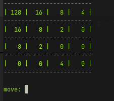

# 2048 Exploration

### Objective

Implement a playable 2048 clone with the game state and game manager in a single C# class.

### Outcome

Implemented a simple CLI based 2048 clone within a single C# class, including the game state and game loop.

It is unoptimized and not an ideal way to do it. Neither is it a reasonable way to do 2048 in Godot.

### Additional Notes

All the notes are in the [2048_exploration.dib polyglot notebook](2048_exploration.dib). This includes all code snippets written during working out the desired functionality.

A working C# console app is included. Running `dotnet run` in this folder will build and run the app. Move with `l, r, u, d` and quit the game with `x`. The game will automatically end and exit if there are no open tiles and no valid moves remaining.