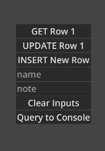
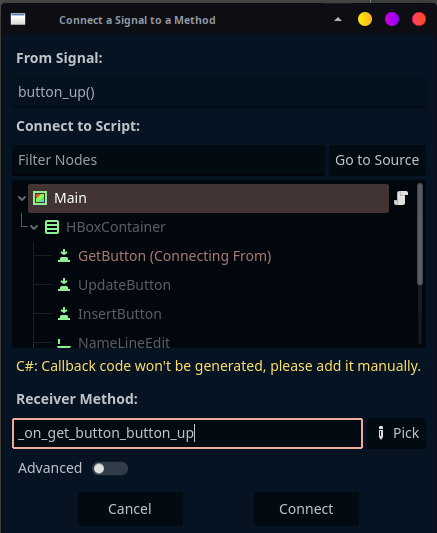

# SQLite on Android

### Objective

* create a Godot 4.4.1 project
* targeting Android build
* using SQLite
* in C#

### Outcome

Attempt to use SQLite on Android failed.

Using SQLite via C# worked perfectly on desktop. When attempting to build and deploy to Android it would throw an exception at run time.

```
E 0:00:01:608 :0 @ (): System.TypeInitializationException: The type initializer for 'Microsoft.Data.Sqlite.SqliteConnection' threw an exception. ---> System.Reflection.TargetInvocationException: Exception has been thrown by the target of an invocation. ---> System.DllNotFoundException: e_sqlite3
```

While researching how to get the DLL into the APK at the appropriate place I found an alternative in LiteDB. LiteDB worked out of the box and the experiment was completed using LiteDB instead.

### Additional Notes

#### Inital Set up

Working with a very simple data model.

| column | type |
|:---:|:---:|
| id | int PK |
| name | text |
| note | text |

UI design was equally straight forward.



| text | node | function |
|:---:|:---:|:---:|
| GET Row 1 | Button | get id 1 and display in LineEdit nodes |
| UPDATE Row 1 | Button | update row 1 with LineEdit values
| INSERT New Row | Button | insert LineEdit values to new row |
| name | LineEdit | name value |
| note | LineEdit | note value |
| Clear Inputs | Button | clear LineEdit nodes |
| Query to Console | Button | query and output all rows to console |

#### Handle Node Signals

This was my first attempt in getting a proper C# project up and running in Godot. There were a few hiccups to solve.

The first was getting node signals to trigger a method within the C# code. This was only a problem as I'd gotten used to how Godot deals with this regarding GDScript. It doesn't matter if you're using the built in Godot code editor or an external IDE. It automatically generates the method for you.

I kept it expecting it to do that. Then got annoyed when it wasn't there in the code after being created. Took a couple tries before I noticed the obvious yellow text in the middle of the pop up.



`C#: Callback code won't be generated, please add it manually.`

#### Absolute DB File Path for SQLite

The next hurdle was ensuring that SQLite had something to work with. To the best of my knowledge, external libraroes won't have any understanding of Godot's `res://` and `user://` resources, that meant doing a little bit of work to ensure I that the resources existed and SQLite had an absolute path to work with.

This was solved in the `_Ready()` method and didn't really change much as the project progressed.

```cs
public override void _Ready()
{
	// create the directory if it doesn't exist
	if (!DirAccess.DirExistsAbsolute(DbDir))
	{
		DirAccess.MakeDirAbsolute(DbDir);
	}

	// create an empty .db file if not exists
	if (!FileAccess.FileExists(DbFile))
	{
		var file = FileAccess.Open(DbFile, FileAccess.ModeFlags.Write);
		file.Close();
	}

	// create an absolute path for the SQLite lib to
	// access the db file
	_dbPath = FileAccess.Open(DbFile, FileAccess.ModeFlags.Read).GetPathAbsolute();
}
```

#### Build & Debug from VS Code

I was able to get build & run up quite easily, but the debug wasn't working the way I'd expected it to. When working with GDScript, I didn't have any issues debugging within VS Code.

This ended up just being a matter of setting up an appropriate launch configuration. Nothing important to put here beyond not being able to rely solely on the default configuration and needing to make some manual updates. Pulled the configuration mostly from [chickensoft](https://github.com/chickensoft-games/GameDemo/blob/main/.vscode/launch.json).

#### Android and the Infinite Sadness

Made the glorious mistake here of getting SQLite and local debugging working, then going on my merry way of implementing/testing all the intended functionality on my desktop before building and installing to my Android device.

```
E 0:00:01:608 :0 @ (): System.TypeInitializationException: The type initializer for 'Microsoft.Data.Sqlite.SqliteConnection' threw an exception. ---> System.Reflection.TargetInvocationException: Exception has been thrown by the target of an invocation. ---> System.DllNotFoundException: e_sqlite3
```

As mentioned above, the DLL wasn't being included in anyway the application could use it automatically. (Or at all?) I spent a little bit of time researching solutions. There were a couple with the same issue for a different library. The solutions required manual workarounds that went against the spirit of what I was attempting to do. Make an application that can use SQLite on Android, not shoehorn SQLite by any means necessary.

#### LiteDB

During my research on the above I found a couple others with the same issue attempting to use SQLite. None of them had answers. One person answered their own question noting they'd tried LiteDB and it worked out of the box.

Excellent.

I started the process of migrating the SQLite code to LiteDB. Again, it worked fine on desktop and threw an error on Android.

```
E 0:00:01:580   :0 @ Godot.GodotObject Godot.NativeCalls.godot_icall_2_512(nint, string, int): Condition "p_mode_flags & FileAccess::WRITE" is true. Returning: ERR_UNAVAILABLE
  <C++ Source>  platform/android/file_access_android.cpp:61 @ open_internal()
```

There's a bigger stack trace there, but this is the important part. In this case, I was saving everything to `res://`. It worked fine locally, I assumed it would also work on Android as well. It did not appear to do so.

As soon as I switched from `res://` to `user://` it worked fine from that point on. Reimplemented all the SQLite functionality for LiteDB and then removed all the SQLite references.

All the code is in [Main.cs](Source/Main.cs). The relevant sections have been documented.


