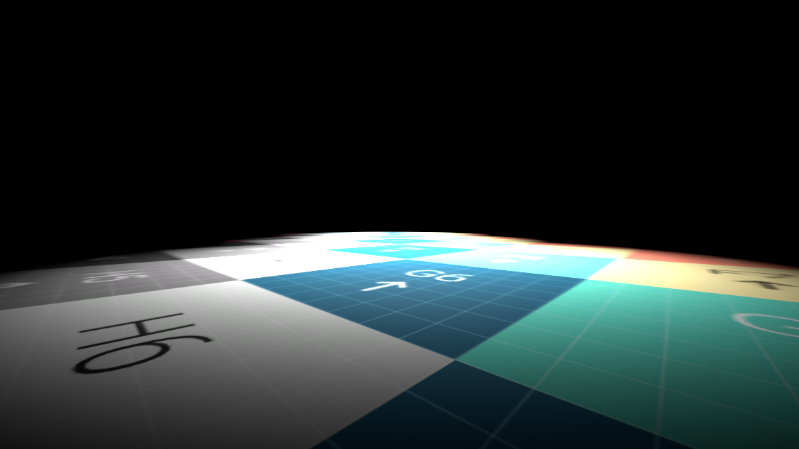

# walking_sim

### Objective

Using the [Mini Jam 182](https://itch.io/jam/mini-jam-182-horror) timeframe, explore what is required to get a basic walking sim framework together in Godot with C#.

### Outcome

Created a basic scene with a player character that uses a controller to operate. Implemented the following:

* dual stick move/look controls
* gravity/falling
* jumping
* coyote time
* importing objects from Blender

### Additional Notes

#### Working in 3D

I haven't really spent any time, up to this point, working in 3D with Godot. The approach here was to just try and figure it out first, then look it up if I was having issues.

The first thing I needed to figure out was how I had constrained the displayed Nodes to just 2D & Control.

`Editor` > `Manage Editor Features`

There's an option in here to set up different profiles for the editor. Luckily I was smart enough to set up a new profile for the way my editor was configured and it was just a matter of going back to the previous profile.

My initial list of "minimally, I need" to get started

* a surface with a collision box to move around on
* a character body with a collision box
* a POV camera that moves with the player
* player input move & turn

Recognizing that a grey box in a grey space wasn't going to give me any meaningful feedback, I wanted to put some kind of material onto my eventual surface. I went looking for a checker map and found this.

[UV Checker Map Maker](https://uvchecker.vinzi.xyz)

Which is just all kinds of excellent.

Created a `CSGBox3D` as I wasn't really sure what the "appropriate" thing to use was. In retrospect, I suspect `MeshInstance3D` is the proper Node to use here, as noted by the (`CSGBox3D` documentation)[https://docs.godotengine.org/en/stable/classes/class_csgbox3d.html]:

> Note: CSG nodes are intended to be used for level prototyping. Creating CSG nodes has a significant CPU cost compared to creating a MeshInstance3D with a PrimitiveMesh. Moving a CSG node within another CSG node also has a significant CPU cost, so it should be avoided during gameplay.

Next was my UV map onto the object. That was just a drag and drop. It applied automatically, but showed up mirrored. I'm sure there's a reason for that, but I haven't looked into the why yet. Looking through the inspector for the object I found `GeometryInstance3D` > `Geometry`. I set the X scale to `-1.0` and that displayed it correctly.

Added a `Camera3D` and an `OmniLight3D`. That's enough to start getting _something_ when running the game.

Collision is where I had one of my significant stumbling blocks on this. One of those instances that, once figured out, becomes one of the mistakes you won't make again in the future.

I created an `Area3D` and a `CollisionShape3D` to go along with my `CSGBox3D`. The box has been transformed to make side and flat. A floating platform. Creating the `CollisionShape3D` I selected `BoxShape` and then tranformed it to make the `CSGBox3D`. Where I was greeted by the warning:

> A non-uniformaly scaled CollisionShape3D will probably not function as expected.

At this point, instead of looking up what the resolution was, I moved to a `CollisionPolygon3D`. While it didn't really work the way I expected, it got where I needed to go.

My first session ended here.



#### Adding the player

Added a `CharacterBody3D` with a `CSGCylinder3D` and a `CollisionShape3D`. Pulled it up above the ground and ran the game. The character body floated in the air, which I didn't not expected.

> **CharacterBody3D** is a specialized class for physics bodies that are meant to be user-controlled. They are not affected by physics at all, but they affect other physics bodies in their path.

In my head, I was expect physics to be automatically applied. Did a little bit of investigation around using a `StaticBody3D` or just an `Area3D` and realized that I just wasn't really cluing in to what need to be done. So, back to the docs.

[Your first 3D game/Moving the player with code](https://docs.godotengine.org/en/stable/getting_started/first_3d_game/03.player_movement_code.html)

Which brought me back around to the `CharacterBody3D` and the following:

```cs
if (!IsOnFloor())
{
	_targetVelocity.Y -= FallAcceleration * (float)delta;
}
```

Between that and basic movement, I was able to move a character around on the platform. If I fell off the edge it was an endless fall.

I didn't really like the bundle of `if` statements to get the input. Went looking for alternatives and found this tutorial at `kidscancode.org`.

[CharacterBody3D: Movement](https://kidscancode.org/godot_recipes/4.x/3d/characterbody3d_examples/index.html)

I much prefered the `Input.GetAxis` method to the `if` statements, as it boiled down four `if` statements (four lines a piece in C#) to this:

```cs
float move = Input.GetAxis("move_backward", "move_forward");
float step = Input.GetAxis("move_right", "move_left");
```

Then moved on to rotating the character, being able to turn left and right. My basic movement code looked like this.

```cs
// rotate the player on the Y axis to turn
RotateY(RotMult * turn * (float)delta);
// move the character forward and backward
Velocity += -Transform.Basis.Z * move * MoveSpeed * (float)delta;
// move the character side to side
Velocity += -Transform.Basis.X * step * MoveSpeed * (float)delta;
```

The final piece was adding the ability to look up and down. This needed to be separate from the code I had to avoid the player trying to walk into the sky or the ground. This further needed to be clamped to prevent the player from rolling over into a crab walk or running around looking between their legs.

Added a `Node3D` to the player character and used this as a parent node to the camera and flashlight. This can be manipulated independently of the player character.

```cs
// _pov is assign the `POV` Node3D in the _Ready function
_pov.RotateX(RotMult * look * (float)delta);
// set clamp value to roughly 1.2
float lookClamp = Mathf.Pi / 2.6f;
// clamp rotation values
float x = Mathf.Clamp(_pov.Rotation.X, -lookClamp, lookClamp);
// use existing Y & Z values
float y = _pov.Rotation.Y;
float z = _pov.Rotation.Z;
// apply the rotation
_pov.Rotation = new Vector3(x, y, z);
```

That rounded out the first day's worth of work.

#### Cleaning Up Player Control

I went looking for a little info getting gravity (jumping and falling) working properly and came across this tutorial: [Basic FPS Character](https://kidscancode.org/godot_recipes/4.x/3d/basic_fps/index.html)

 I found something else interesting in there.

 I had left the prior day with these input controls.


```cs
float move = Input.GetAxis("move_backward", "move_forward");
float step = Input.GetAxis("move_right", "move_left");
```

And this was fine. Until I saw this.

```cs
Vector2 input = Input.GetVector("move_right", "move_left", "move_backward", "move_forward");
```

This is much more succicint and really only requires ensuring I assign the XY valuesa appropriately as XZ when using the `Transform` for my `Velocity`. One `Vector2` providing the same information as two `float` values makes my brain happy.

With all of this in mind, I added a `Transform` on the Y axis to my `Velocity` and I had falling/gravity.

```cs
Velocity += -Transform.Basis.Y * (float)_gravity * FallSpeed * (float)delta;
```

Hide that behing a `!IsOnFloor` check and now the player will fall any time they're not on the floor.

I wasn't entirely sure the best way to handle the falling and respawn. I have considered setting a basic global Y value as being the threshold. If the player passes that value then they need to be respawned back at the beginning of the map.

This could be a solid solution in a larger context as it could be a modifiable value set by the level when the player character is spawned. In the context of what I'm doing here, it wasn't necessary. I chose instead to use a Y velocity value to decide if the player had fallen far enough. Since there's no friction in this implementation, the veclocity will continue to increase forever. By picking a value where the velocity should reasonably extend past where an expect fall could happen, that becomes the reasonable value to respawn the player.

Threw the respawn position in as a `Marker3D` node and apply the nodes position and rotation to the player while resetting the player's velocity on spawn/respawn. I initially had a bug that was confusing me briefly where the velocity was carried over and the player simply kept going back to the respawn over and over after the initial respawn.

Adding jump was trivial once all of this was up and running. Assigning a button, apply velocity greater than gravity. Jump acheived.

#### Final Additions

I also added in a rocking chair object from a Blender scene I had sitting on my hard drive from an old project. That imported perfectly, aside from the origin point being in a weird spot. That was in the initial object in Blender, not a Godot problem. I'm sure there's an easy way to fix that in Godot, but I haven't looked into it yet.

Add some more platforms and objects to give something to move around in. Also included a moving platform, just to see what the implementation looked like. Pretty straight forward to do without code.

The last thing I did was to implement a little bit of _coyote time_ on the player. I was missing some jumps and it didn't feel right. Once I put in a basic state manager for the player (`[Walk, Jump, Fall]`) it was pretty straight forward to implement a simple timer for enabling _coyote time_.

All the code is contained within [Camera.cs](source/Camera.cs) and has been annontated.